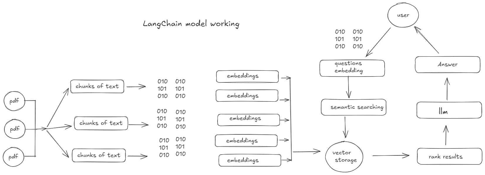

# streamlit_chatbot

## MultiPDF Chat App


## Introduction
The Chat App is a Python application that allows to chat with multiple PDF documents. ask questions about the PDFs using natural language, and the application will provide relevant responses based on the content of the documents. Application utilizes a language model to generate accurate answers to your queries. 

### Working



The application follows these steps to provide responses to your questions:

### PDF Loading: 
The app reads multiple PDF documents and extracts their text content.

### Text Chunking: 
The extracted text is divided into smaller chunks that can be processed effectively.

### Language Model: 
The application utilizes a language model to generate vector representations (embeddings) of the text chunks.

### Similarity Matching: 
When you ask a question, the app compares it with the text chunks and identifies the most semantically similar ones.

### Response Generation: 
The selected chunks are passed to the language model, which generates a response based on the relevant content of the PDFs.

### Installation
To install the MultiPDF Chat App, please follow these steps:

Clone repository to local machine.

Install the required dependencies
```bash 
command:
pip install -r requirements.txt
```
Obtain an API key from OpenAI and add it to the .env file in the project directory.
```bash
OPENAI_API_KEY=api_key
HUGGINGFACEHUB_API_TOKEN= api_key
```


### steps:

install the required dependencies and add OpenAI API key to the .env file.

Run the main.py file using the Streamlit CLI. 
command:
```bash
streamlit run app.py
```
The application will launch in default web browser, displaying the user interface.

Load multiple PDF documents into the app.

Ask questions in natural language about the loaded PDFs using the chat interface.